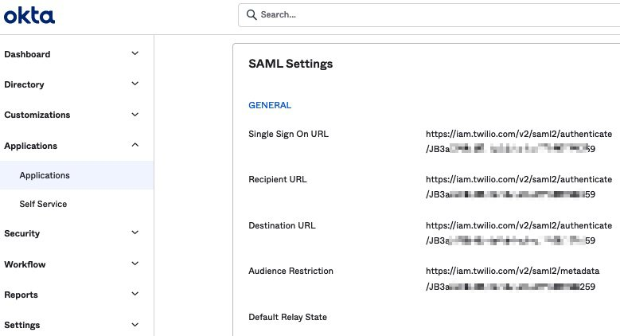
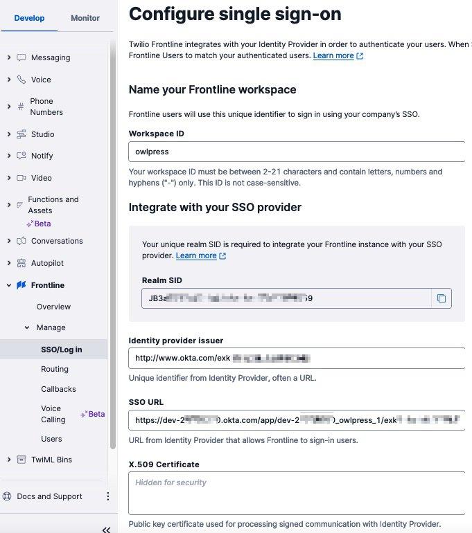
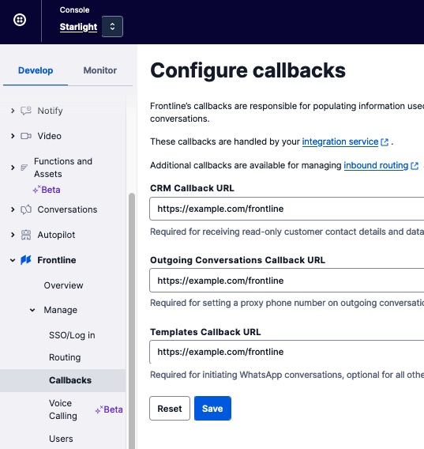
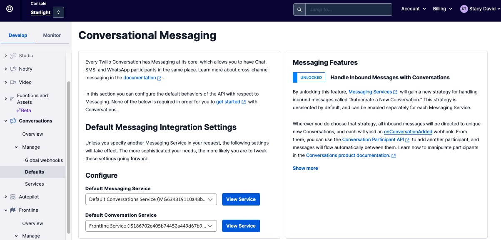
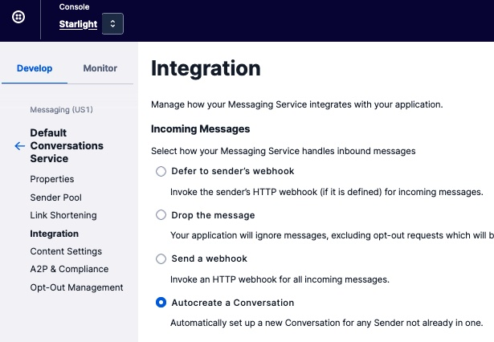

#### Application Files

+ [webserver.js](webserver.js) : a NodeJS Express HTTP Server that processes client requests.
+ [modules/customer.js](modules/customer.js) : Customer data in JSON format, with methods to retrieve data formatted for Frontline app responses.
+ [modules/templates.js](modules/templates.js) : Template data in JSON format, with functions to process and format the templates into messages.
+ [moduleCustomersTest.js](moduleCustomersTest.js) : command line program for testing customer data queries.
+ [moduleTemplatesTest.js](moduleTemplatesTest.js) : command line program for testing template data queries.
+ [app.json](app.json) and [package.json](package.json) : for deploying to Heroku.

--------------------------------------------------------------------------------
# Frontline Integration Service Example

This README has information for using and implementing a Frontline Integration Service web application.

This application handles all HTTP requests from a Twilio Frontline app:
+ For a Frontline worker's customer list.
+ For a customer details.
+ For message templates to use when sending a message.
+ For an SMS Twilio phone number or Twilio WhatsApp senderid, to use when sending a message.

My Frontline [set up steps and configurations](https://github.com/tigerfarm/work/tree/master/book/Frontline).

For testing, you will need to use one of the Frontline client worker apps:
+ Twilio Frontline mobile app that is available of Google Play, and for Apple devices.
+ Twilio Frontline web application you can use for testing:
[Frontline web application](https://frontline.twilio.com/login)

--------------------------------------------------------------------------------
## Getting Started with this Repository

Download the repositry files to your working directoy.
From GitHub repositry page, click the Code selector button.
+ Click Download to download a zip file of the repository.
+ Unzip the file into a working directory.
+ Go into the directory and list the files.

Create environment variables. For example:
````
export MAIN_AUTH_TOKEN=...
export FRONTLINE_TWILIO_SIGNATURE=abCDe1fg2hiJKlmnoP3quSTuvwx=
export FRONTLINE_SMS_NUMBER=+16505551111
export FRONTLINE_WHATSAPP_NUMBER:+14155551111
````
Start the web server.
````
$ node webserver.js 
+++ Start Frontline Integration Service Application web server, integration to CRM data.
+ From a browser, can check that the server is running.
+ Listening on port: 8080
````
Once running, can use the following cURL commands to test the application.

Folloing are sample Frontline requests.
Note, the value of the environment value FRONTLINE_TWILIO_SIGNATURE,
can be used as a test validation signature.
When used in the header of an POST HTTP request, the request will be allowed.
````
export FRONTLINE_TWILIO_SIGNATURE=abCDe1fg2hiJKlmnoP3quSTuvwx=

curl -X POST 'http://localhost:8080/frontline' \
  --header 'Content-Type: application/x-www-form-urlencoded' \
  --header 'x-twilio-signature: abCDe1fg2hiJKlmnoP3quSTuvwx=' \
  --data-urlencode "Location=GetCustomersList" \
  --data-urlencode "Worker=dave@example.com"

curl -X POST 'http://localhost:8080/frontline' \
  --header 'Content-Type: application/x-www-form-urlencoded' \
  --header 'x-twilio-signature: abCDe1fg2hiJKlmnoP3quSTuvwx=' \
  --data-urlencode "Location=GetCustomerDetailsByCustomerId" \
  --data-urlencode "CustomerId=2"

curl -X POST 'http://localhost:8080/frontline' \
  --header 'Content-Type: application/x-www-form-urlencoded' \
  --header 'x-twilio-signature: abCDe1fg2hiJKlmnoP3quSTuvwx=' \
  --data-urlencode "Location=GetProxyAddress" \
  --data-urlencode "channelName=sms"

curl -X POST 'http://localhost:8080/frontline' \
  --header 'Content-Type: application/x-www-form-urlencoded' \
  --header 'x-twilio-signature: abCDe1fg2hiJKlmnoP3quSTuvwx=' \
  --data-urlencode "Location=GetTemplatesByCustomerId" \
  --data-urlencode "CustomerId=2"

* Confirm the templates are using another worker's data.
curl -X POST 'http://localhost:8080/frontline' \
  --header 'Content-Type: application/x-www-form-urlencoded' \
  --header 'x-twilio-signature: abCDe1fg2hiJKlmnoP3quSTuvwx=' \
  --data-urlencode "Location=GetTemplatesByCustomerId" \
  --data-urlencode "CustomerId=3"
````

--------------------------------------------------------------------------------
## Once Setup, Using Okta Admin to Manage Frontline Worker Access

Steps to Configure [Okta as a Frontline Identity Provider](https://www.twilio.com/docs/frontline/sso/okta):
````
1. Register a developer account at Okta
2. Create an application on Okta
3. Configure your Application (in Okta)
4. Configure Claims (in Okta)
5. Copy Application details: get information for Okta, to use in Twilio Frontline configurations.
6. Assign Users to the Application
7. Configure Frontline with your new SAML credentials: paste Okta information into your Twilio Frontline SSO configurations.
````

Log into [my Okta account](https://dev-12345678.okta.com/).
````
Applications/Applications, click your application: Owl Press
Under the "Assignments" option, left option "People", is the list your Okta users,
    "Persons" assigned to this application.
Click a Person.
Click Profile.
    You will see: User type/userType is "agent" (Configure Claims setting).

Under the "Sign On" option, is the SAML Signing Certificates information.
In the table, beside: SHA-1, click Actions and select View IdP MetaData.
    This will display the Frontline/Manage/SSO/Log in values,
        + Frontline Identity provider issuer URL (entityID attribute):
        http://www.okta.com/ex...d7
        + Frontline SSO URL(SingleSignOnService attribute):
        https://dev-12345678.okta.com/app/dev-12345678_owlpress_1/ex...d7/sso/saml
        + Frontline X.509 Certificate (X509Certificate attribute)
        MIID...pDw==

Under the "General" option, is the Frontline SAML Settings,
    That include your Frontline JBxxx id.
    Table that should be:
Attribute Statements
Name    Name Format Value
email   Basic       user.email
roles   Basic       user.userType
````

How to Configure Okta as a Frontline Identity Provider
https://www.twilio.com/docs/frontline/sso/okta
````
1. Register a developer account at Okta
2. Create an application on Okta
3. Configure your Application (in Okta)
4. Configure Claims (in Okta)
5. Copy Application details: get information for Okta, to use in Twilio Frontline configurations.
6. Assign Users to the Application
7. Configure Frontline with your new SAML credentials: paste Okta information into your Twilio Frontline SSO configurations.
````



--------------------------------------------------------------------------------
## Frontline Twilio Console Configurations










--------------------------------------------------------------------------------
## Using Frontline with the Twilio WhatsApp Sandbox

I setup my Frontline system to use the Twilio WhatsApp Sandbox.

Results of my testing:
+ I can use a program(I use curl) to send template messages to my WhatsApp user.
+ In my WhatsApp user app, I can receive and read messages from my program.
+ In my WhatsApp user app, I can send messages to my Frontline user.
+ In my Frontline app, I can receive and read messages from my WhatsApp user.
+ In my Frontline app, I can reply to the received messages from my WhatsApp user.
+ In my WhatsApp user app, I can receive and read messages from my Frontline user.

To use Twilio WhatsApp Sandbox templates, or pre-approved account templates:
+ Add the template into .../routes/callbacks/templates.js.
+ Where required, add template parameters for the template.
+ In the Frontline app, when selecting a WhatsApp conversation, if not within a 24 hour session, I'm prompted to select a template. For example: "Reach out to John". When I click the Reach-out prompt, I can see the Sandbox templated message with the parameters filled in. If I click it, it's sent to my WhatsApp user.
+ In my WhatsApp user app, I can receive and read the templated message from my Frontline user.

Notes,
+ Frontline requires templates to be added into the integration service via the templates callback URL, and indicate that it’s a pre-approved WhatsApp template: attribute: whatsAppApproved: true.
+ I added a sample Sandbox template into my WhatsApp integration application. Program sample:
[templates.js](https://github.com/tigerfarm/tfpfrontline/blob/master/src/routes/callbacks/templates.js).

Sending WhatsApp messages to a WhatsApp user, from the Twilio WhatsApp Sandbox sender id.
````
curl -X POST https://api.twilio.com/2010-04-01/Accounts/$MASTER_ACCOUNT_SID/Messages.json \
--data-urlencode 'To=whatsapp:+16505552222' \
--data-urlencode 'From=whatsapp:+14155551111' \
--data-urlencode 'Body=Your Twilio code is 1234561' \
-u $MASTER_ACCOUNT_SID:$MASTER_AUTH_TOKEN
````

Sending SMS messages to a mobile phone number, from the Twilio WhatsApp Sandbox sender id.
````
curl -X POST https://api.twilio.com/2010-04-01/Accounts/$MASTER_ACCOUNT_SID/Messages.json \
--data-urlencode 'To=+16505552222' \
--data-urlencode 'From=+14155551111' \
--data-urlencode 'Body=Your Twilio code is 1234561' \
-u $MASTER_ACCOUNT_SID:$MASTER_AUTH_TOKEN
````

--------------------------------------------------------------------------------
## Links

[Frontline application](https://github.com/twilio/frontline-demo-service)
I've cloned and updated in this repository.

--------------------------------------------------------------------------------

Cheers...